# Chatterino Icons

<!-- markdownlint-disable-file MD033 -->

Uncategorized

| Name  | Current                  | Propsed Dark Theme       | Proposed Light Theme      |
| ----- | ------------------------ | ------------------------ | ------------------------- |
| error |  |  |  |

Buttons

| Name                      | Current Dark Theme                                                   | Current Light Theme                                                    | Propsed Dark Theme                                           | Proposed Light Theme                                          |
| ------------------------- | -------------------------------------------------------------------- | ---------------------------------------------------------------------- | ------------------------------------------------------------ | ------------------------------------------------------------- |
| addSplit                  |                        | 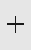                                 | ?                                                            | ?                                                             |
| ban                       |                                          |                                                                        |                                  |                                  |
| banRed                    |                                    |                                                                        |                            |                            |
| cancel                    |                                    |                              |                  |                  |
| chatters                  |                      |                          | 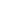                       | 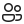                       |
| clearSearch               |                          |                                                                        |                  |                  |
| copy (png)                |                              |                                  | -                                                            | -                                                             |
| copy (svg)                |                              |                                  |                                |                                |
| emote                     |                                      |                                |                              |                              |
| menu                      |                              |                                  |                                |                                |
| mod                       |                                          |                                                                        | ?                                                            | ?                                                             |
| modModeDisabled           |                  |                                                                        | ?                                                            | ?                                                             |
| modModeEnabled            |                    |                                                                        | ?                                                            | ?                                                             |
| pinDisabled (png)         |                |                    | -                                                            | -                                                             |
| pinDisabled (svg)         |                |                    |                  |                  |
| pinEnabled (png)          |                            |                                                                        | -                                                            | -                                                             |
| pinEnabled (svg)          |                            |                                                                        |                    |                    |
| replyDark (png)           |                              |                                                                        | -                                                            | -                                                             |
| replyDark (svg)           |                              |                                                                        |                              |                              |
| replyThreadDark (png)     |                  |                                                                        | -                                                            | -                                                             |
| replyThreadDark (svg)     |                  |                                                                        |                  |                        |
| search                    |                                    |                                                                        |                            |                            |
| streamerModeEnabled (png) |  |  | -                                                            | -                                                             |
| streamerModeEnabled (svg) |  |  |  |  |
| timeout                   |                                  |                                                                        |                          |                          |
| trashCan                  |                                |                                                                        |                        |                         |
| unban                     |                                      |                                                                        |                              |                              |
| unmod                     |                                      |                                                                        | ?                                                            | ?                                                             |
| unvip                     |                                      |                                                                        | ?                                                            | ?                                                             |
| update                    |                                    |                                                                        |                            |                            |
| updateError               |                          |                                                                        |                  |                  |
| vip                       |                                          |                                                                        | ?                                                            | ?                                                             |

`trashcan`, `modModeDisabled2`, and `modModeEnabled2` are unused.

Scrolling

| Name                | Current                                            |
| ------------------- | -------------------------------------------------- |
| downScroll (png)    |        |
| downScroll (svg)    |        |
| neutralScroll (png) |  |
| neutralScroll (svg) |  |
| upScroll (png)      |            |
| upScroll (svg)      |            |

Settings

| Name          | Current                                           | Proposed Dark Theme                               | Proposed Light Theme                               |
| ------------- | ------------------------------------------------- | ------------------------------------------------- | -------------------------------------------------- |
| about         |                  |                  |                  |
| aboutlogo     |          | 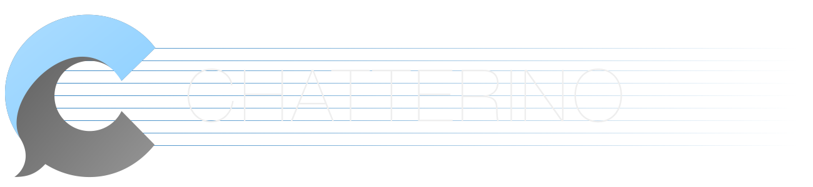         | 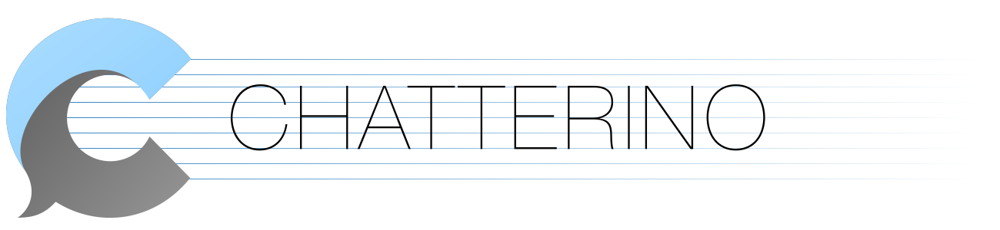         |
| accounts      |            |            |            |
| commands      |            |            |            |
| externaltools | 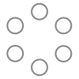 |  |  |
| filters       |              |              |              |
| ignore        |                |                |                |
| keybinds      | 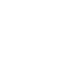           |            |            |
| moderation    |        | ?                                                 | ?                                                  |
| notification2 |  |  |  |
| notifications |  |  |  |
| plugins       |              |              |              |

`advanced`, `behave`, `browser`, `emote`, and `theme` are unused.

Split

| Name  | Current                        | Proposed Dark Theme            | Proposed Light Theme            |
| ----- | ------------------------------ | ------------------------------ | ------------------------------- |
| down  |    |    |    |
| left  |    | 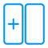   |    |
| move  |    |    |    |
| right |  | 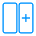 |  |
| up    |        | 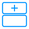       |        |

Switcher

| Name   | Current                             | Proposed Dark Theme                 | Proposed Light Theme                 |
| ------ | ----------------------------------- | ----------------------------------- | ------------------------------------ |
| plus   |      |      |      |
| popup  |    |    |    |
| switch |  |  |  |

Titlebar

These are manually drawn right now.

| Name     | Current Dark Theme                           | Current Light Theme                           | Proposed Dark Theme                     | Proposed Light Theme                     |
| -------- | -------------------------------------------- | --------------------------------------------- | --------------------------------------- | ---------------------------------------- |
| minimize |  |  |  |  |
| maximize |  |  |  |  |
| restore  | 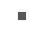   |    |    |    |
| close    |        |       |        |        |
| user     |          |          |          |          |
| settings |  |  |  |  |

